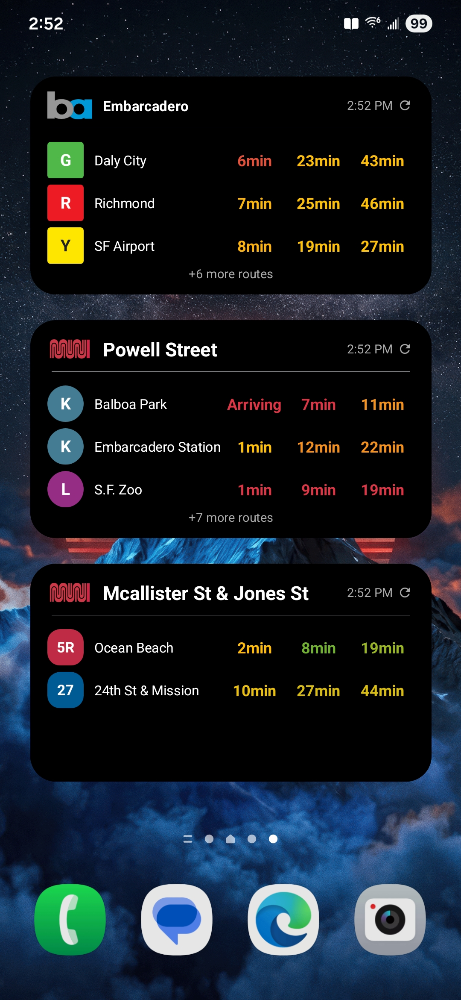
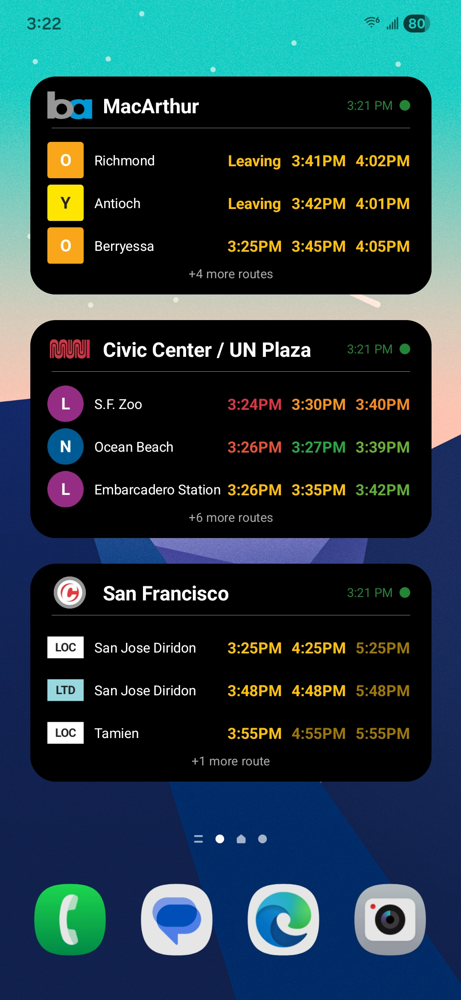
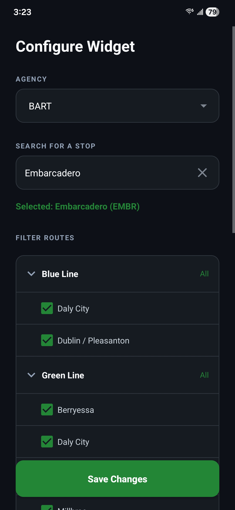
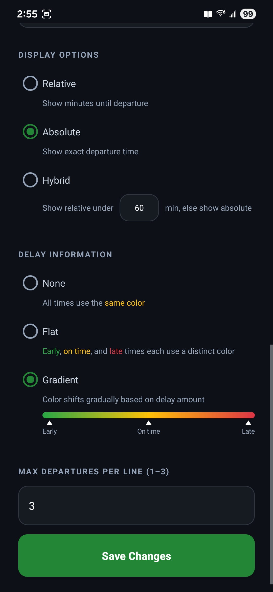

# TransitTime

<div align="center">
  <div>
    
    &nbsp;&nbsp;&nbsp;&nbsp;
    
  </div>
  <div>
    <em>Widgets on the home screen</em>
  </div>
  <br/>
  <div>
    
    &nbsp;&nbsp;&nbsp;&nbsp;
    
  </div>
  <div>
    <em>Configuration process</em>
  </div>
</div>

## Overview

TransitTime is a widget-only Android app that shows real-time departure times for BART, Muni, and
Caltrain directly on your home screen.

Each widget is configured for a single stop and displays upcoming departures by route, with support
for filtering by specific headsigns, multiple display modes, and color-coded delay indicators.

**Supported agencies:**

- BART
- San Francisco Muni (bus and metro)
- Caltrain

## Features

- Tap anywhere below the header to manually refresh the widget. The widget will still auto-refresh
  every 15 minutes.
- Tap on the header to cycle between relative → absolute → hybrid display modes.

## How to install

TransitTime is not on the Google Play Store and must be sideloaded manually.

**1. Prerequisites**

- [Android Studio](https://developer.android.com/studio) installed
- An Android device running API 26 (Android 8.0) or higher
- USB cable or wireless debugging enabled

**2. Get API keys** (free, takes a few minutes)

- **BART:** Register at [api.bart.gov](https://api.bart.gov/api/register.aspx) to get a BART API key
- **511 SF Bay** (used for Muni and Caltrain): Register
  at [511.org](https://511.org/open-data/token) to get a 511 API key

**3. Configure keys**

In the root of the project, create a `local.properties` file if it doesn't exist and add:

```properties
bart.api.key=YOUR_BART_KEY
muni.api.key=YOUR_511_KEY
```

**4. Build and install**

- Clone this repository
- Open the project in Android Studio
- Connect your device and run the app

**5. Add a widget**

- Long press your home screen → Widgets → TransitTime → Real Time Departures
- Configure your stop, agency, routes, and display options

## Limitations

- Both the BART and 511 APIs have a rate limit of 60 requests/ minute. This should be fine as long
  you don't configure too many widgets and don't spam refresh.
