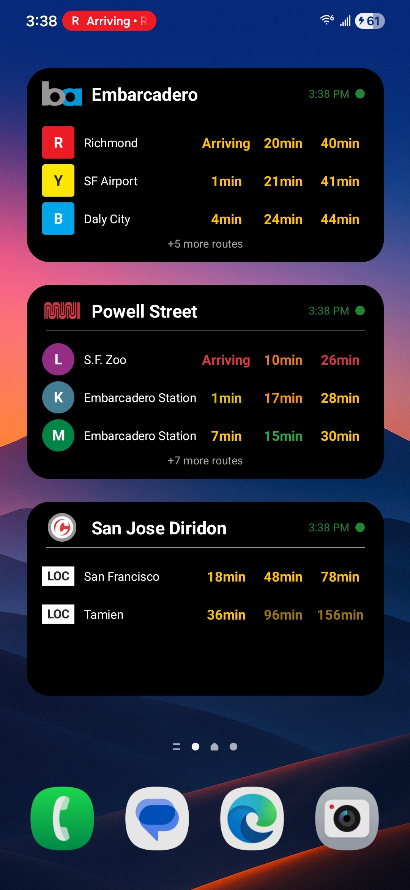
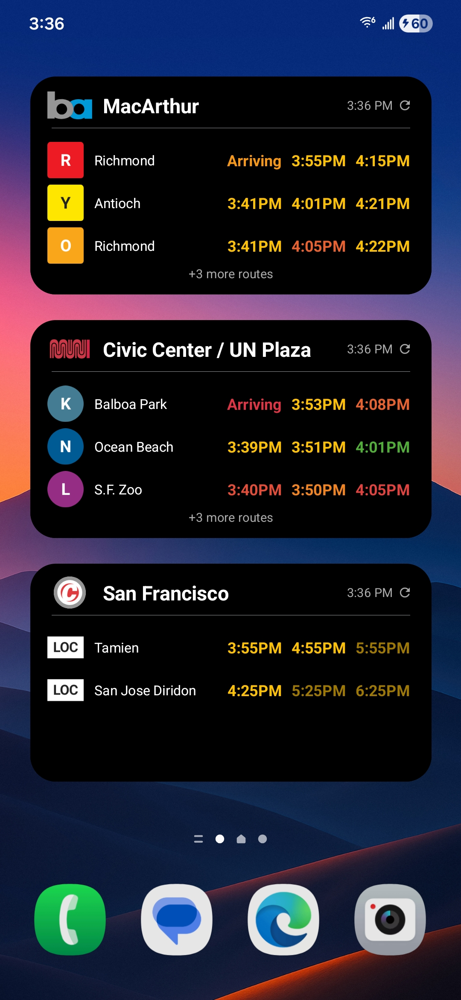
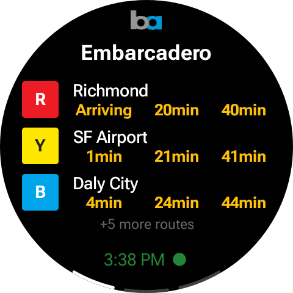
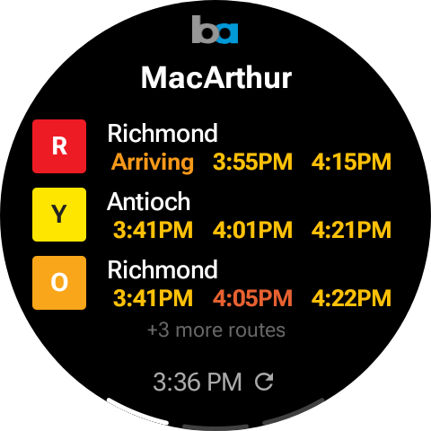

# TransitTime

<div align="center">
  <div>
    
    &nbsp;&nbsp;&nbsp;&nbsp;
    
  </div>
  <div>
    <em>Widgets on the home screen</em>
  </div>
  <br/>
  <div>
    
    &nbsp;&nbsp;&nbsp;&nbsp;
    
  </div>
  <div>
    <em>Wear OS tile</em>
  </div>
</div>

## Overview

TransitTime is a widget-only Android app and optional companion Wear OS watch tile that shows
real-time
departure times for BART, Muni, and Caltrain.

Each widget is configured for a single stop and displays upcoming departures by route, with support
for filtering by specific headsigns, multiple display modes, and color-coded delay indicators.

**Supported agencies:**

- BART
- San Francisco Muni (bus and metro)
- Caltrain

## Features

**Phone widget features**

- Tap anywhere below the header (on the departure info) to manually refresh the widget. The widget
  will still auto-refresh
  every 15 minutes.
- Tap the agency logo or station name to cycle between relative → absolute → hybrid display modes.
- Tap the last refreshed timestamp area to toggle **Go Mode**.
    - Go Mode will automatically refresh all widgets frequently for 20 minutes.
    - This is useful when you are on the way to a station - you can see the status of your bus/train
      in real time without needing to manually refresh.

**Watch tile features**

- Tap anywhere in the middle (on the departure info) to manually refresh the tile.
- Tap the agency logo or station name to cycle between configured stops.
- Tap the last refreshed timestamp area to toggle **Go Mode**.

**Notes**

- The phone and watch will remain synced at all times. Triggering a refresh or toggling Go Mode
  on one device will update the other.
- Activating Go Mode will spawn a live notification in the status bar and on the watch face that
  shows information about the next departure.

## How to install

TransitTime is not on the Google Play Store and must be sideloaded manually.

**1. Prerequisites**

- [Android Studio](https://developer.android.com/studio) installed
- An Android device running API 26 (Android 8.0) or higher
- USB cable or wireless debugging enabled

**2. Get API keys** (free, takes a few minutes)

- **BART:** Register at [api.bart.gov](https://api.bart.gov/api/register.aspx) to get a BART API key
- **511 SF Bay** (used for Muni and Caltrain): Register
  at [511.org](https://511.org/open-data/token) to get a 511 API key

**3. Configure keys**

In the root of the project, create a `local.properties` file if it doesn't exist and add:

```properties
bart.api.key=YOUR_BART_KEY
transit511.api.key=YOUR_511_KEY
```

**4. Build and install**

- Clone this repository
- Open the project in Android Studio
- Connect your device and run the app

**5. Enable permissions**

- The phone and watch processes should prompt you to enable notifications and disable battery optimization.
- Additionally, on your phone go to Settings → Developer Options → enable "Live notifications for all apps".

**6. Add a widget**

- Long press your home screen → Widgets → TransitTime → Real Time Departures
- Configure the following:
    - Agency
    - Stop
    - Routes
    - Display options
        - Relative - Show the number of minutes until departure (ex. "3min")
        - Absolute - Show the exact departure time (ex. "2:35PM")
        - Hybrid - Show relative times for departures less than 60min away, else show absolute
          times. The exact threshold is
          configurable.
    - Delay information - Color is used to indicate delay status
        - None - All times will display in the same color
        - Flat - Early, on time, and late times each use a distinct color
        - Gradient - Color shifts gradually based on delay amount
    - Max departures per line (1 - 3)

## Limitations

- Both the BART and 511 APIs have a rate limit of 60 requests/ minute. This should be fine as long
  you don't configure too many widgets and don't spam refresh.
